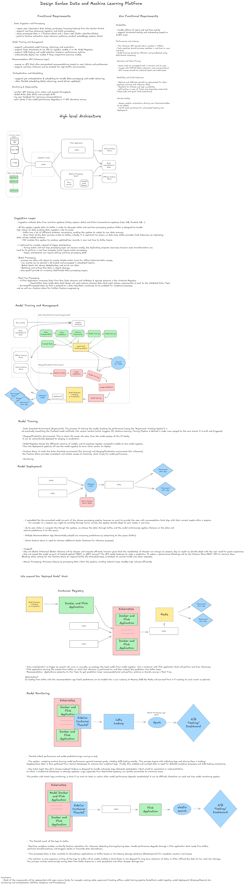

# Sanlam Recommendation Service

This is a recommendation service designed to provide product recommendations for customers based on their data. The service uses collaborative filtering and is containerized using Docker for easy deployment and scaling. This system integrates with Redis for caching and FastAPI for building the REST API.

## Overview

Sanlam, a leading financial services provider, is transitioning from a service-oriented to a platform-oriented architecture. As part of this move, a recommendation service for the Sanlam Portal needs to be developed. The solution will ingest data, train machine learning models, serve predictions, and handle scalability and reliability.

## Architecture

### Components:
1. **FastAPI**: The web framework used to expose the API endpoints.
2. **Collaborative Filtering Model**: A machine learning model that generates recommendations based on user-item interactions.
3. **Redis**: Caching layer to store and serve recommendations quickly.
4. **Docker**: Containerized environment for easy deployment.
5. **Docker Compose**: Orchestration for the Redis service and application container.


## Instructions to Run the Service

### Prerequisites

Before running the service, ensure that the following tools are installed:
- Docker
- Docker Compose

### Step 1: Clone the Repository

```bash
git clone https://github.com/Motsepe-Jr/recommedation_system_design.git
cd recommedation_system_design
```
### Step 2: Build and Run the Containers
The service is containerized using Docker and orchestrated with Docker Compose.

1 Build and run the service:
```bash
docker-compose up --build
```
This command will:
- Build the Docker images defined in the Dockerfile.
- Start the application and the Redis container.
- Expose the API on port 8000.
- Check if the service is running: Once the container is running, the API will be accessible on http://localhost:8000.

### Step 3: Test the Endpoints

The following endpoints are available:

- GET /recommendations/customer/{customer_id}
Get product recommendations for a customer.

Example Request:
```bash
curl http://localhost:8000/recommendations/customer/99900826
```

Example Response
```json
{"customer_id":"99900826","recommendations":[{"product_id":"prd_sanlam_funeral_cover","product_name":"Funeral Cover","score":0.0},{"product_id":"prd_sanlam_life_insurance","product_name":"Life Insurance","score":0.0},{"product_id":"prd_sanlam_personal_loans","product_name":"Personal Loans","score":0.0}],"model_version":"1.0.0","timestamp":"2025-03-09T22:26:36.351589"}
```

- GET /products/popular
Get the most popular products.
Example Request:
```bash
curl http://localhost:8000/products/popular
```

- GET /health
- GET /admin/retrain
```bash
curl http://localhost:8000/admin/retrain
```

### Machine Learning System Design

Please click on the link to access the ML system design: https://excalidraw.com/#json=3pp_QmsiFVw06CeWPc2od,cKOZoPUzUzkEWtmq_9Du4Q  (zoom in out or out for great experience)





### License

This project is licensed under the MIT License - see the LICENSE file for details.

```vbnet
Let me know if you'd like further edits or changes!
```